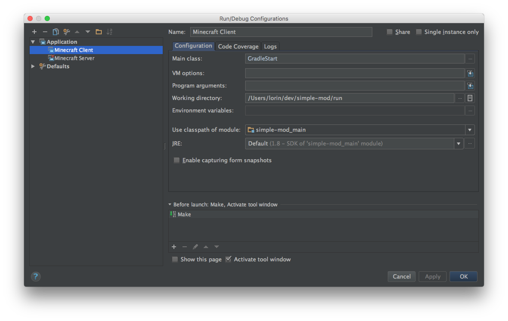
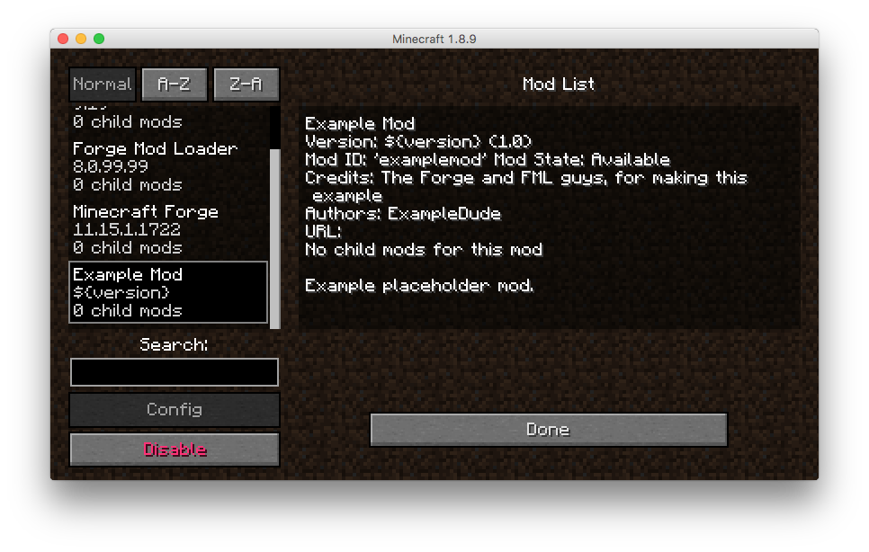

# Creating a new project

This assumes:

* Minecraft is installed
* Running on OS X
* IntelliJ is installed


I'm going to use `~/dev/simple-mod` as the location for the mod files, and
`simplemod` as the name of the mod, in the org.lorinhochstein.simplemod group.


## Download the Mod Development Kit

1. Go to <http://files.minecraftforge.net/> and in the "Download Recommended" box,
click the disk image labeled "Mdk".

2. You'll likely get some horrible popup asking you to to download a new media
player or somesuch. Cancel that download.

3. Click the red SKIP button in the top right-hand corner.

4. Download the file, should be named something like forge-1.8.9-11.15.1.1722-mdk.zip

## Create a git repo, unzip the files and commit it

```
mkdir ~/dev/simple-mod
cd ~/dev/simple-mod
unzip ~/Downloads/forge-1.8.9-11.15.1.1722-mdk.zip
git init
echo classes >> .gitignore
git add .
git commit -m 'initial commit'
```

## Modify build.gradle

Here are the changes I made:

```
diff --git a/build.gradle b/build.gradle
index 8b83723..382a6bb 100644
--- a/build.gradle
+++ b/build.gradle
@@ -21,8 +21,8 @@ plugins {
 }
 */
 version = "1.0"
-group= "com.yourname.modid" // http://maven.apache.org/guides/mini/guide-naming-conventions.html
-archivesBaseName = "modid"
+group= "org.lorinhochstein.simplemod" // http://maven.apache.org/guides/mini/guide-naming-conventions.html
+archivesBaseName = "simplemod"

 minecraft {
     version = "1.8.9-11.15.1.1722"
```

## Download artifacts needed for decompiling and building

```
./gradlew setupDecompWorkspace
```

## Open the project in IntelliJ IDEA

```
idea .
```

1. Brings up the "Import Project from Gradle" dialog.
2. Click "OK" at bottom-right.

## Create run configuration

Exit IntelliJ IDEA, then do:

```
./gradlew genIntellijRuns
```

## Configure run configuration

1. Launch IntelliJ IDEA loaded with the project
1. In the "Run configurations" dropdown at the top-right of IDEA, cilck on the down
   arrow and choose "Edit Configurations..."
1. Choose "Minecraft Client" in the left-hand pane
1. For "Use classpath of module", click the dropdown and choose
   "simple-mod_main"



Once this is done:

1. Click "OK" to dismiss the dialog
1. Run the "Minecraft Client" configuration.

This should load Minecraft.

## Verify the mod loaded properly

1. Click the "Mods" button in the Minecraft dialog.
1. Choose "Example Mod" in the scroller on the right

Dialog should look like:




## Customize the metadata

See also [official docs on FML mod information file][fmlmodinfo].

[fmlmodinfo]: https://github.com/MinecraftForge/FML/wiki/FML-mod-information-file


Edt `src/main/resources/mcmod.info`. Mine looks like:

```
diff --git a/src/main/resources/mcmod.info b/src/main/resources/mcmod.info
index f480667..53350db 100644
--- a/src/main/resources/mcmod.info
+++ b/src/main/resources/mcmod.info
@@ -1,14 +1,14 @@
 [
 {
-  "modid": "examplemod",
-  "name": "Example Mod",
-  "description": "Example placeholder mod.",
-  "version": "${version}",
-  "mcversion": "${mcversion}",
+  "modid": "simplemod",
+  "name": "Simple Mod",
+  "description": "A simple mod example",
+  "version": "1.0",
+  "mcversion": "1.8.9",
   "url": "",
   "updateUrl": "",
-  "authorList": ["ExampleDude"],
-  "credits": "The Forge and FML guys, for making this example",
+  "authorList": ["Lorin Hochstein"],
+  "credits": "",
   "logoFile": "",
   "screenshots": [],
   "dependencies": []
```

## Create Java package and file

We need an org.lorinhochstein.simplemod.SimpleMod Java
class.

1. View > Tool Windows > Project
1. Expand simple-mod > src > main > java
1. Right-click on java
1. New > Package
1. Type `org.lorinhochstein.simplemod` and click OK
1. Right-click on org.lorinhochstein.simplemod
1. New > Java Class
1. Type `SimpleMod` and click OK
1. Write an initial no-op implementation:


```
package org.lorinhochstein.simplemod;

import net.minecraftforge.fml.common.Mod;
import net.minecraftforge.fml.common.event.FMLInitializationEvent;

@Mod(modid = SimpleMod.MODID, version = SimpleMod.VERSION)
public class SimpleMod {
    public static final String MODID = "simplemod";
    public static final String VERSION = "1.0";

    @Mod.EventHandler
    public void init(FMLInitializationEvent event)
    {
        // nothing here yet
    }
}
```

## Delete ExampleMod.java

Delete `src/main/java/com/example/examplemod/ExampleMod.java`. Easiest is to
click on it in IDEA and hit the "delete" key.
